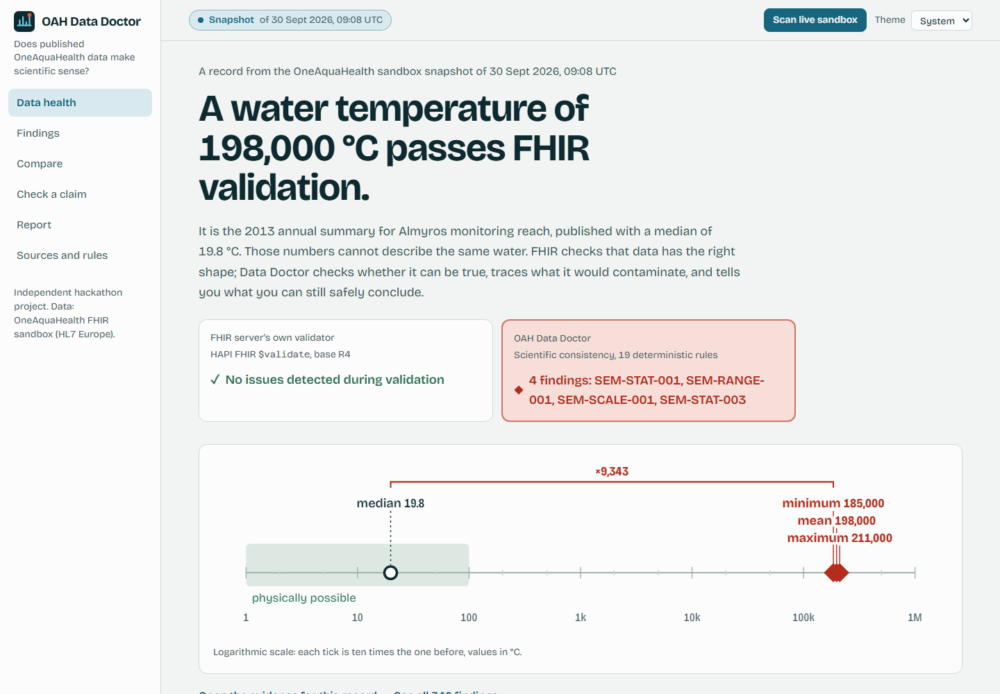
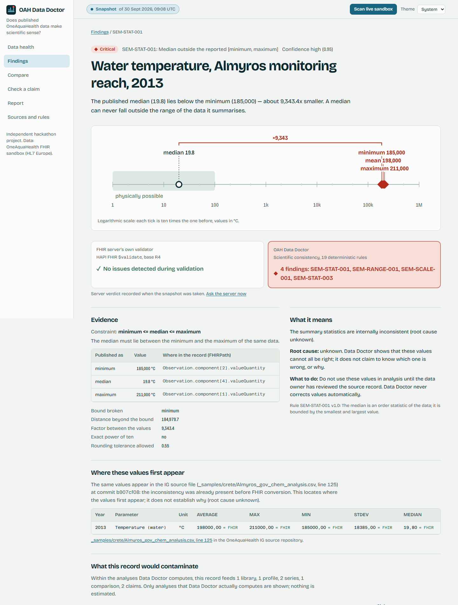
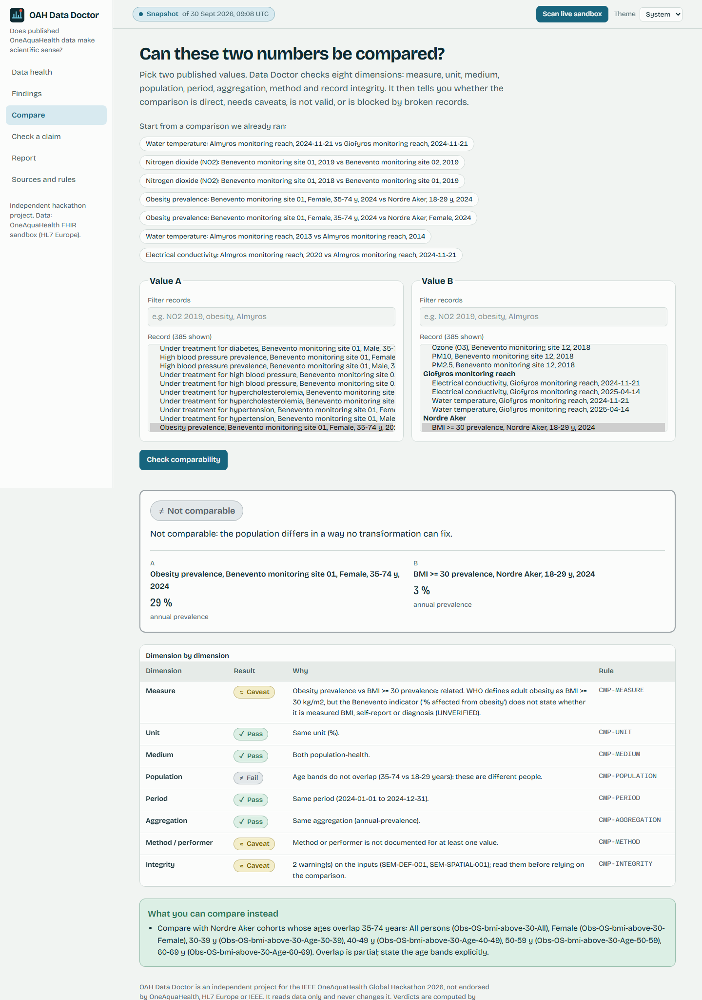
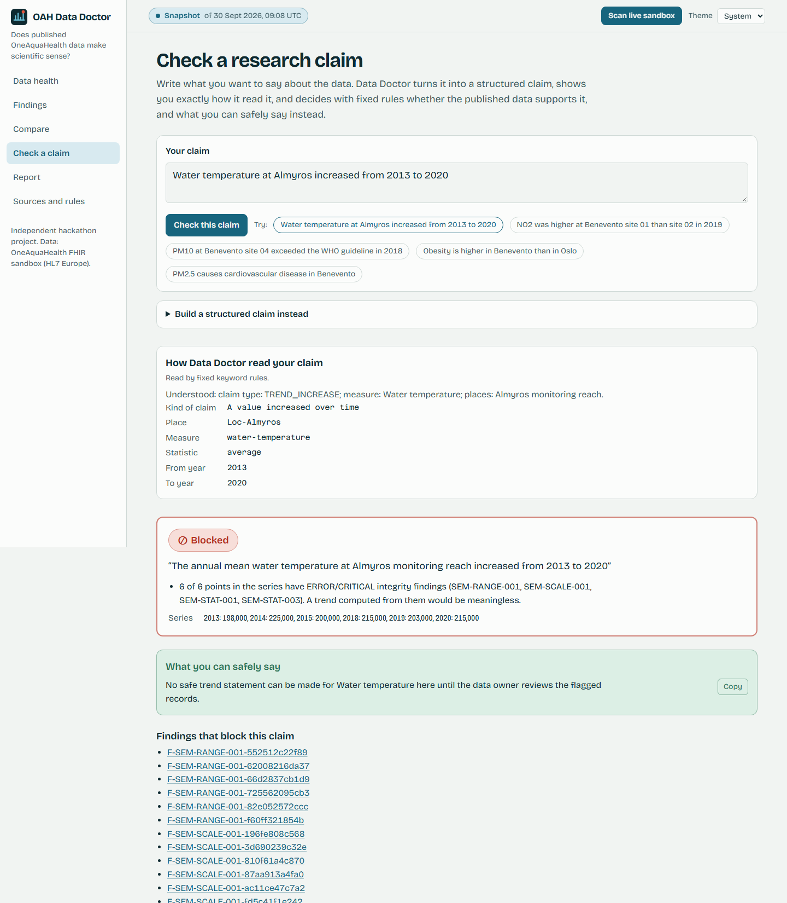
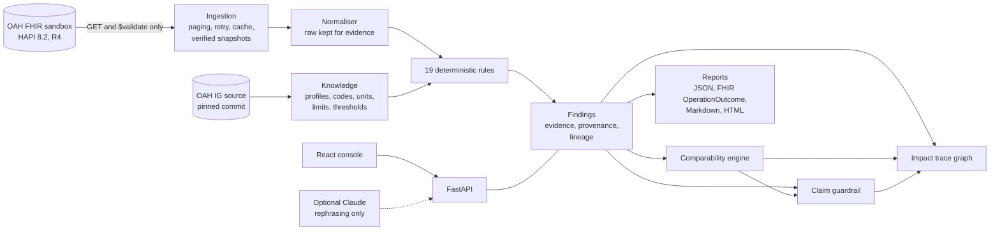

# OAH Data Doctor

**FHIR tells you whether data is shaped correctly. Data Doctor tells you whether it makes scientific sense, and what you can safely conclude from it.**

OAH Data Doctor is a deterministic, evidence-producing auditor for the OneAquaHealth FHIR sandbox. It reads the published
environmental and health data (read-only) and does four things:

1. **Doctor**: finds structural *and* semantic/statistical problems that a FHIR conformance check cannot see.
2. **Trace**: shows which analyses, comparisons and claims a bad record would contaminate.
3. **Compare**: decides whether two indicators are scientifically comparable (direct, conditional, not comparable, or blocked by broken records), dimension by dimension.
4. **Claim guardrail**: for a research claim, says supported, conditional, unsupported or blocked, why, and what can safely be said instead.

Built for the IEEE OneAquaHealth Global Hackathon 2026, Track 7 (Digital Health Standards). Independent project: not endorsed
by OneAquaHealth, HL7 Europe or IEEE.



## What it found in the OneAquaHealth sandbox

Every number below is computed by the tool from snapshot `2026-09-30T09-08-55Z` of the live sandbox (fetched 2026-09-30T09:08:55Z,
manifest sha256 `49995f970d8dfa40d6af4b596a7fe6d730ca78ad732d7f948d005dea5f6a1af6`). `python scripts/render_docs.py` regenerates this file, and a test fails if it drifts from a fresh audit.

- **The server's own validator accepts every record. Data Doctor flags 125 of 385 official observations.**
  The sandbox's HAPI FHIR `$validate` was run on 385 official observations and reported 0 errors.
  All 125 observations that Data Doctor flags as error or critical passed that validation.
- **The anchor record.** `Obs-Almyros-TemperatureWater-2013` publishes an annual water temperature with mean 198,000 °C,
  minimum 185,000 °C, maximum 211,000 °C and median 19.8 °C. The median lies outside the range
  of the data it summarises, and the other three values are physically impossible for liquid water. Rules fired: SEM-RANGE-001, SEM-SCALE-001, SEM-STAT-001, SEM-STAT-003.
  The same values appear in the IG's source spreadsheet (`_samples/crete/Almyros_gov_chem_analysis.csv, line 125`), so the
  inconsistency predates FHIR conversion. Root cause: unknown.
- **The pattern is systemic in the Almyros chemistry summaries.** 100 records have a median outside
  [minimum, maximum], 52 have a mean outside it, 51 have a mean–median gap larger than their
  standard deviation (a mathematical impossibility), and 101 have mean and median on scales at least 100× apart.
  62 of those are an exact power of ten apart: a scale signature, not a proof of cause.
- **Domain knowledge FHIR cannot encode.** 24 records hold physically impossible values (water above 100 °C,
  pH above 14, conductivity above that of brine). 4 Benevento site-years report PM2.5 above PM10, although PM2.5
  is a subset of PM10. Health indicators are *defined* as "cases per 100,000 inhabitants" but published in %. Two
  near-identical indicator definitions disagree for the same cohorts. 12 distinct monitoring sites share one coordinate.
  6 pH records carry an invalid or missing UCUM unit.
- **Negative controls stay clean.** The Oslo cohort data pass every partition and complement check, and every published data-set
  Library matches its declared contents.

In total: 346 findings (125 critical, 212 error, 9 warning) from 12 of
19 rules, over 561 resources. 260 of 385 official observations (67.5 %) are safe
to use as published. We report what was observed. We do not claim to know why any value is wrong, and we never modify the data.

## The four capabilities

| Doctor: evidence for one record | Compare: eight dimensions | Claim guardrail |
|---|---|---|
|  |  |  |

- **Doctor.** 19 rules in three families: structural checks the server cannot run (OAH profiles transcribed from the IG's FSH,
  UCUM, references, data-set membership), statistical identities that hold for *any* real data (min ≤ median ≤ max,
  \|mean − median\| ≤ SD, SD ≤ range/√2), and domain knowledge (physical limits, subset relations, cohort partitions,
  terminology). Every value is compared within half a unit of its last published decimal, so rounding alone never raises a finding.
  Each finding shows the exact FHIRPath, the values, the broken constraint, a confidence, the server's own verdict for the same
  record and, where available, the source-spreadsheet row it came from.
- **Trace.** A dependency graph from each record to the data sets, annual series, comparisons and claims Data Doctor actually
  computes, including the ones a user ran. It never estimates impact. For the anchor record: "Within the analyses Data Doctor computes, this record feeds 1 library, 1 profile, 2 series, 1 comparison, 2 claims."
- **Compare.** Measure identity (with an explicit concept map), unit (explicit conversion table), medium, population (sex and
  age-band overlap), period, aggregation, method and record integrity. The verdict precedence is NOT over BLOCKED over CONDITIONAL
  over DIRECT, and alternatives are computed from records that exist. Example: Benevento women aged 35–74 against Oslo adults
  aged 18–29 is **not comparable**, and the tool lists the Oslo cohorts whose ages do overlap.
- **Claim guardrail.** Five claim types (higher-than, trend, exceeds threshold, association, causal). Trends use an exact
  Mann–Kendall permutation test and Theil–Sen slope; thresholds carry their legal context (WHO 2021, EU 2008/50, EU Drinking Water
  Directive); association requires enough paired sites; causal wording is never supported by aggregated observational data.
  On this data the catalog of 10 claims gives 2 BLOCKED, 2 CONDITIONAL, 1 SUPPORTED, 5 UNSUPPORTED, and the 7 comparisons give 1 BLOCKED_BY_INTEGRITY, 3 CONDITIONAL, 1 DIRECT, 2 NOT.

## How it works



- **Deterministic core.** Detection, comparability and claim verdicts use no language model. Optionally, Claude can rephrase an
  already computed finding or read a typed claim into the structured form shown to the user. Any rephrasing that contains a
  number not present in the evidence is discarded, and a fixed template is used instead. The product works fully with the LLM off
  (the default).
- **Read-only by construction.** The HTTP client refuses every method except GET and POST to `$validate`, and it refuses to
  follow paging links to another host (tested).
- **Live vs snapshot, always labelled.** Live runs show their fetch time. Snapshots are dated, carry a sha256 for every file,
  and are verified before use. If the sandbox is down, the app falls back to the latest verified snapshot and says so on screen.
  This matters: the sandbox's DNS record was missing for about a week during the hackathon (hl7-eu/oah#8).
- **Scoped honestly.** The sandbox is writable and contains 111 resources written by other projects. Official
  records are identified by the IG's example ids, not by `meta.profile`.

More: [architecture](docs/03_ARCHITECTURE.md), [rules catalog](docs/04_RULES_CATALOG.md),
[data and schemas](docs/05_DATA_AND_SCHEMAS.md), [discovery log](docs/DISCOVERY.md), [decisions](docs/DECISIONS.md).

## Evidence that it works

- **156 backend tests** (unit tests for every rule with positive, negative and edge cases; Hypothesis property
  tests; contract tests against the published JSON Schemas and the FHIR R4 schema; API and snapshot integration tests) and
  **15 Playwright tests** (run on desktop, with the home page also run on a mobile viewport). The Playwright tests cover the demo path with all external network blocked, plus
  axe-core WCAG 2.1 AA scans of every main page in light and dark mode. CI runs ruff, mypy, pytest and Playwright.
- **Property tests.** Summaries of randomly generated real samples, rounded at 0–4 decimals, never trigger a statistical-identity
  rule. This is the false-positive guarantee behind the precision tolerance.
- **Fault-injection evaluation.** 251 of 251 injected faults of 15 types were
  detected by the rule designed for them (95 % CI 98.5–100.0 %). There were 0 new findings on 100 records
  after benign, scientifically valid transformations (95 % CI 0.0–3.7 %). The first run of this evaluation found a real
  false-positive bug (unit-unaware cross-record comparison), which is now fixed and regression-tested.
  This measures rule sensitivity to known patterns, not real-world accuracy. See [docs/EVALUATION.md](docs/EVALUATION.md).
- **Gate 0.** [docs/GATE0_REPORT.md](docs/GATE0_REPORT.md) prints 20 randomly sampled live findings with raw evidence. Each is
  independently re-derived from the raw JSON by separate code (20 of 20 confirmed). The spec also requires a human
  reviewer's sign-off, which is recorded in that file's sign-off section.
- **Our own FHIR output validates.** The OperationOutcome export has 0 errors against the official R4 JSON schema, and the
  sandbox's HAPI validator reports no issues ([docs/VALIDATION.md](docs/VALIDATION.md)).

## Quick start

Requirements: Python 3.11+, Node.js 20+ (for the UI). Works on Windows, macOS and Linux.

```bash
python tasks.py setup      # or: make setup   (virtualenv, backend, UI build)
python tasks.py test       # backend tests
python tasks.py run        # http://127.0.0.1:8321  (live sandbox, falls back to the verified snapshot)
```

- Offline demo: `DD_SOURCE=snapshot python tasks.py run` (PowerShell: `$env:DD_SOURCE="snapshot"; python tasks.py run`).
- Command line: `python tools/oah_audit.py audit --source live`, plus `snapshot`, `gate0` and `verify-snapshot`.
- Evaluation: `python tasks.py evaluate`. End-to-end: `python tasks.py e2e`.
- Configuration: `.env.example`. No secrets are needed. `ANTHROPIC_API_KEY` is only used if you set `DD_LLM_PROVIDER=anthropic`.

API highlights: `GET /api/overview`, `GET /api/findings`, `GET /api/findings/{id}`, `POST /api/compare`, `POST /api/claims`,
`POST /api/claims/parse`, `GET /api/reports/operation-outcome.json`. OpenAPI docs are at `/docs`.

## Repository layout

```
backend/datadoctor/   ingestion, normalization, rules, comparability, claims, trace, provenance, reporting, ai, api
backend/tests/        unit, property, contract, integration
frontend/             React + TypeScript console (Vite, Tailwind) and Playwright tests
knowledge/            OAH knowledge derived from the IG source; plausibility, thresholds, units, concept maps
schemas/              JSON Schemas of the public contract + the official FHIR R4 schema
data/snapshots/       verified snapshot(s) of the sandbox for offline, reproducible runs
docs/                 brief, spec, architecture, rules catalog, discovery, Gate 0, evaluation, decisions, demo, submission
tools/oah_audit.py    standalone CLI
```

## Limitations

- A finding proves that published values cannot all be right. It does not say which value is wrong or why.
- Cohort sizes, sample counts and data coverage are not published, so differences between cohorts cannot be tested for
  significance. The guardrail says so instead of guessing.
- OAH profile checks are transcribed by hand from the IG's FSH (the sandbox does not host the profiles and the IG website was
  offline), and cover the checkable subset of constraints.
- Plausibility "typical ranges" are general; values outside them are reported as unusual, never as wrong.
- The analysis catalog is small and curated, so the impact trace reports only what Data Doctor computes, not every possible use.
- The IG source declares no licence at the pinned commit. Derived knowledge is attributed and kept separate (see NOTICE).

## AI assistance disclosure

This project was built with substantial help from an AI coding assistant (Claude, by Anthropic), which drafted code, tests and
documentation under human direction. The product itself uses no AI to detect problems or decide verdicts. An optional,
switched-off-by-default Claude integration can only rephrase already computed findings or propose a structured reading of a
typed claim.

## Attribution and licence

Data: OneAquaHealth FHIR sandbox, operated by HL7 Europe. Definitions: OneAquaHealth FHIR Implementation Guide
([hl7-eu/oah](https://github.com/hl7-eu/oah), commit `b907cf08`). OneAquaHealth is funded by the European Union's Horizon
Europe programme. Code: Apache-2.0 (see LICENSE and NOTICE).
