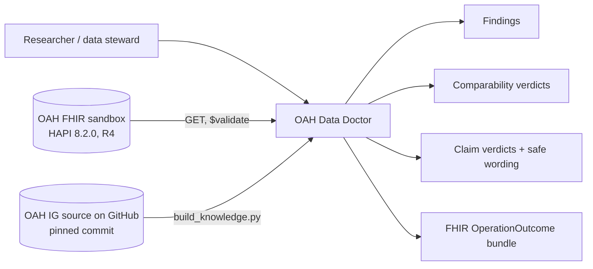
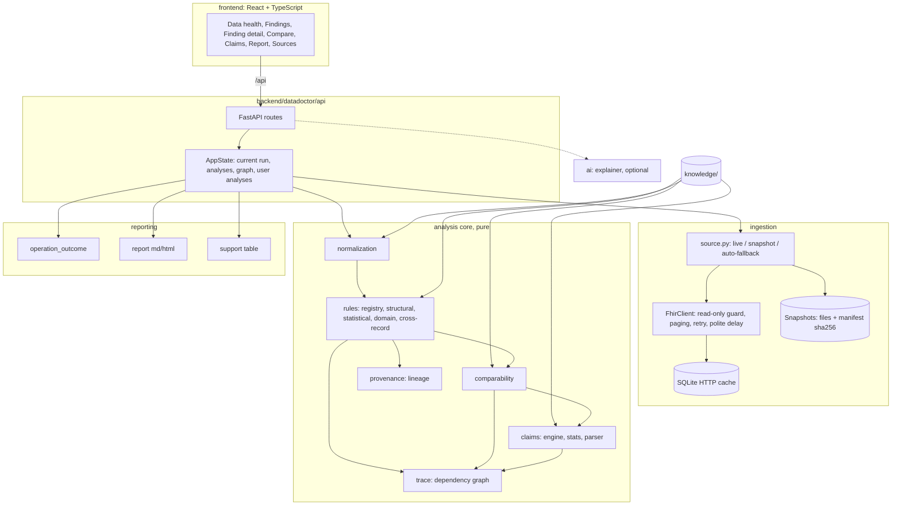

# 03 — Architecture

## 1. Goals and non-goals

Goals: deterministic, reproducible, evidence-producing analysis of published OAH FHIR data; read-only access; offline
operation; one place (the backend) that talks to the FHIR server.

Non-goals: a generic FHIR validator, data correction, a distributed system. There is no Kafka, Kubernetes, Redis, PostgreSQL,
Neo4j, vector database or agent swarm. None of them solves the problem, which is *FHIR data → evidence → deterministic reasoning →
researcher-facing decision*.

## 2. Principles

- The UI never talks to the OAH server. Everything goes through the API.
- Domain code (rules, comparability, claims, trace) receives normalised objects and knows nothing about HTTP, SQLite, FastAPI or LLMs.
- Knowledge (limits, thresholds, units, concept maps, profile constraints) is data in `knowledge/`, versioned by content hash.
- Every run records its source (live URL and fetch time, or snapshot id and manifest hash), its rules version and its knowledge version.

## 3. System context

## 4. Components (as built)

Package map: `ingestion/` (fhir_client, cache, snapshot, source), `normalization/`, `knowledge/loader`, `domain/` (models,
enums), `rules/` (base, registry, structural, statistical, domain, crossrecord), `comparability/engine`, `claims/` (engine,
stats, parser), `trace/graph`, `provenance/lineage`, `audit/` (service, analyses), `reporting/` (operation_outcome, report,
support), `ai/explainer`, `api/` (main, state), `cli.py`.

## 5. Dependency rules

Allowed: API → application (audit, analyses) → domain and engines; application → infrastructure (ingestion, SQLite);
infrastructure → external systems. Forbidden: domain or rules → FastAPI, httpx, SQLite or LLM; UI → OAH directly.
`mypy` and code review enforce this; the rule modules import only `domain`, `knowledge` and `rules.base`.

## 6. Data flows

**Audit.** `load_data(mode)` → raw resources by type (live: paged search per type; snapshot: verified files) →
`build_dataset` (normalise, keep raw, sha256 per resource, IG scope, upstream files) → `run_all` (deterministic rules, ids
de-duplicated) → lineage attached → `AuditResult` (summary, findings, versions) → `run_catalog` (catalog + user comparisons and
claims) → `build_graph`.

**Comparability.** Two observation ids → descriptors (measure, unit, medium, cohort, period, aggregation, method, value) → eight
dimension checks → verdict with precedence NOT > BLOCKED_BY_INTEGRITY > CONDITIONAL > DIRECT → alternatives from existing records.

**Claim.** Text → (optional) parser → ClaimIntent → resolver onto existing records → StructuredClaim shown to the user →
deterministic engine → ClaimResult. The verdict depends only on the StructuredClaim.

## 7. Storage

- SQLite (`data/datadoctor.sqlite`, not committed): HTTP cache, run index, user-run analyses.
- Filesystem: `data/snapshots/<utc>/` (committed, byte-exact via `.gitattributes`), `data/reports/<run>/audit.json`.
- Knowledge: `knowledge/` (committed). `knowledge/oah/` is regenerated from the IG source by `scripts/build_knowledge.py`.

## 8. API

REST/JSON under `/api`: status, audit, overview, findings (+ detail, explain), resources, validate (live `$validate`),
trace, observations, compare, claims (+ parse), analyses (+ reset), knowledge, rules, support, runs, reports.
OpenAPI at `/docs`. The built UI is served by the same process (single port, 8321).

## 9. Frontend

React 19, React Router, Tailwind 4, self-hosted fonts (works offline). There is no chart library: the magnitude ruler and the
trace graph are hand-written SVG with text alternatives. All state comes from the API; a run context refetches pages when a new
run lands.

## 10. Security and safety

See docs/THREAT_MODEL.md. In short: read-only client (method allow-list, host pinning), no secrets required, input validation
by Pydantic, bounded inputs (claim text ≤ 500 characters), CORS restricted to the dev origin, LLM output grounded or discarded.

## 11. Reliability and offline mode

Polite delay (0.25 s), exponential backoff with `Retry-After`, a 60 s timeout, SQLite cache. `DD_SOURCE=auto` serves the latest
verified snapshot when live fails and sets `fallback_reason`, which the UI shows as a banner. At startup the API loads the snapshot
first (instant, offline) and refreshes from live in the background.

## 12. Testing boundaries

Unit tests exercise rules and engines against small explicit fixtures. Property tests check the rule invariants. Contract tests
check the JSON Schemas and the FHIR R4 schema. Integration tests run the API and the committed snapshot. Playwright tests the UI
offline and runs axe-core. The evaluation script injects faults. See docs/06_TEST_PLAN.md.

## 13. Deployment

One process: `python tasks.py run` (uvicorn + static UI). For a public demo, put it behind any HTTPS reverse proxy; there is no
database server. Docker is optional and not required.

## 14. Deviations from the planned architecture (build.md)

- Package name `datadoctor` instead of `app`, to avoid a generic top-level import name.
- The graph is a small in-house DAG instead of NetworkX (fewer dependencies; the traversal is about 30 lines and fully tested).
- There is no separate HL7 Java validator: Java is not available in the build environment. OAH profile constraints are checked
  locally from the FSH, base R4 by the sandbox's own `$validate`, and our output by the official R4 JSON schema plus HAPI.
- NumPy, SciPy and pandas are not used: the statistics needed are small and exact (permutation tests), implemented in `claims/stats.py`.
